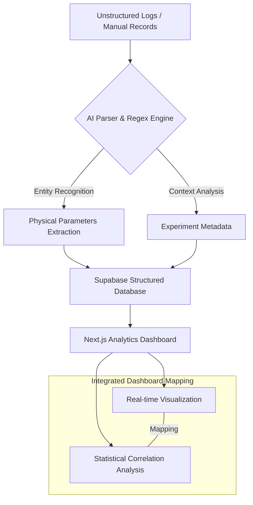

# Intelligent Data Analytics Report: Photonics Experiment Log Analyzer

## 1. Research Background & Data Problem
현대 광학 실험실에서 발생하는 데이터의 대다수는 여전히 비정형 텍스트 로그, 수기 기록, 그리고 다양한 기기에서 출력되는 파편화된 데이터 형식에 머물러 있다. 이러한 **비정형 데이터의 범람**은 연구자들로 하여금 데이터 정리와 전처리에 과도한 시간을 할애하게 만들며, 정작 중요한 데이터 분석 및 인사이트 도출의 병목 현상을 초래한다.

특히, 광학계의 안정성과 실험 결과의 재현성을 확보하기 위해서는 실험 당시의 환경 변수(온도, 습도, 진동 등)와 실제 측정 데이터 간의 통합적인 분석이 필수적이다. 그러나 기존의 데이터 관리 방식으로는 실험 결과와 환경 변수 간의 숨겨진 상관관계를 규명하기 어려운 **데이터 사일로(Data Silo) 현상**이 발생한다. 본 시스템은 이러한 한계를 극복하기 위해 AI 기반의 비정형 로그 분석 및 물리 파라미터 자동 추출 파이프라인을 구축함으로써 데이터 무결성을 확보하고 연구 효율성을 극대화한다.

## 2. NLP & Logic-based Extraction Methodology
본 시스템은 비정형 실험 로그로부터 핵심 물리 파라미터를 정밀하게 추출하기 위해 LLM(Large Language Model)과 정규 표현식(Regex) 기반의 하이브리드 개체명 인식(NER, Named Entity Recognition) 알고리즘을 사용한다.

- **Entity Extraction & Normalization**: 실험 로그 내에 혼재된 레이저 파장($\lambda$), 출력 파워($P$), 측정 시간($t$), 환경 변수 등의 수치 데이터를 감지하고 표준 단위로 정규화(Normalization)한다.
- **Context-aware Parsing**: 단순 키워드 매칭의 한계를 넘어, "Laser power stabilized at 15mW after 5 min"과 같은 문장에서 문맥을 파악하여 의미 있는 상태(State)와 수치를 매핑한다.
- **Physical Parameter Mapping**: 추출된 데이터는 다음과 같은 물리적 관계성을 기반으로 구조화된다.
  - $P(\lambda, t)$: 시계열에 따른 파장별 출력 변화율
  - $\Delta\lambda_{FWHM}$: 스펙트럼 데이터의 반치폭(FWHM) 자동 계산

## 3. System Architecture & Integrated Pipeline
시스템은 비정형 로그의 업로드부터 구조화된 저장 및 분석까지의 전 과정을 자동화된 파이프라인으로 처리한다.

업로드된 로그 파일은 백엔드 엔진에서 파싱되어 Supabase의 PostgreSQL 엔진에 구조화된 스키마로 저장된다. Next.js 기반의 대시보드는 저장된 시계열 데이터와 실험 로그를 실시간으로 매핑하여, 특정 시점의 데이터 튀튀(Trigger) 현상과 당시의 로그 기록을 교차 검증할 수 있는 환경을 제공한다.

## 4. Advanced Analytics & Research Insights
단순 데이터 시각화를 넘어, 본 시스템은 광학 실험의 정밀도를 향상시키기 위한 고급 분석 기능을 탑재하고 있다.

- **Environmental Impact Analysis**: 실험실의 온도, 진동 등 환경 변수가 광학계의 빔 안정성(Beam Stability) 및 노이즈 플로어(Noise Floor)에 미치는 영향력을 통계적으로 분석한다. 이를 통해 외부 간섭 요인에 따른 실험 결과의 편향성을 보정할 수 있다.
- **Anomaly Detection & Prediction**: 기계 학습 기반의 이상 탐지 알고리즘을 적용하여, 실험 진행 중 발생하는 미세한 출력 저하나 파장 변동을 사전에 식별한다. 이는 실험 실패 징후를 조기에 포착함으로써 소중한 시료 및 장비의 손상을 방지하는 데 기여한다.
- **Trend Modeling**: 대규모 실험 데이터셋을 기반으로 데이터 경향성 예측 모델을 구축하여, 장기적인 광학 소자 성능 퇴화 및 안정성 추이를 정량적으로 제시한다.

## 5. Implementation & Technical Specs
시스템은 대규모 실험 로그의 고속 처리를 위해 다음과 같은 기술적 최적화를 수행하였다.

- **Stack**: 
  - **Backend**: Python 3.10+ (NumPy, Pandas, Transformers for LLM-based NER)
  - **Frontend**: Next.js 14 (App Router, Recharts for high-frequency data plotting)
  - **Database**: Supabase (PostgreSQL with Row Level Security)
- **High-speed Parsing**: 비정형 텍스트 로그의 효율적인 처리를 위해 벡터화된 문자열 연산 및 비동기 처리 파이프라인을 구현하였다.
- **Hardware Acceleration**: 로컬 워크스테이션 환경에서 대규모 모델 추론 시 Apple Silicon의 MPS(Metal Performance Shaders) 가속을 활용하여 물리 파라미터 추출 속도를 극대화한다.

---
**Author**: 권해성 (Hanyang University, Computer Science)  
**Research Interest**: Optical Data Science, Lab Automation, Scientific LLM Application
